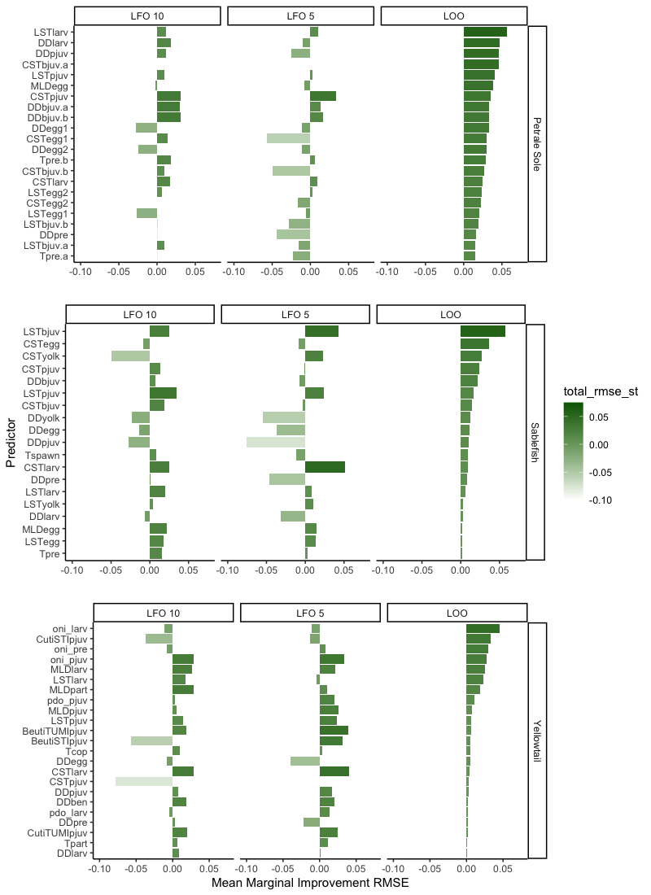
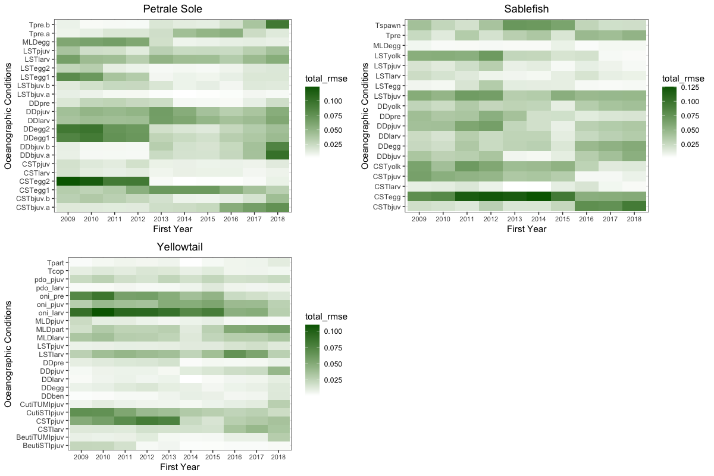
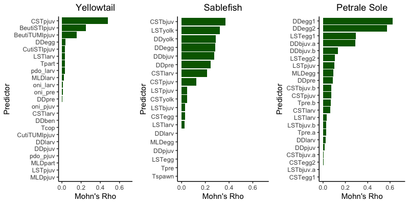

```{r}
#| include: FALSE

library(knitr)
library(dplyr)
library(kableExtra)
library(tidyverse)
```

## Does predictive capacity criteria select different variables?

### Methods

Recruitment deviations were extracted from the 2023 sablefish stock assessment [@Johnson2023], the 2023 petrale sole stock assessment [@Taylor_petrale_2023], and the 2025 northern yellowatil stock assessment [@Oken2025]. GLORYS derived ocean time series begin in 1993 but for some groundfish lifestages, observations from the previous year is necessary to appropriately align the oceanograhic condition with the recruitment estimates (i.e., lagged by one year). Therefore, to ensure a standardized length of time series were used for all analyses, species, and oceanographic predictors that did not include late recruitment deviations models were fit to the time period 1994 - 2018. The exponentiated recruitment deviations are the multiplicative factor by which the expected recruitment from a Beverton-Holt stock-recruitment relationship is multiplied to obtain the estimate of recruitment from the stock assessment model, and represents the synthesis of age and length composition data and survey indices.

Oceanographic conditions were linked to early life history for each species based on literature-informed conceptual life history for yellowtail rockfish [@Feddern2026], sablefish [@Tolimieri2018], and petrale sole [@Haltuch2020]. For petrale sole and sablefish, ROMs based oceanographic indices for the initial publications were converted to GLORYS for the 2023 and 2025 stock assessments, respectively [@Taylor_petrale_2023; @Wetzel2025]. Physical ocean conditions are often correlated due to shared atmospheric forcing, interrelated physics driving variability, and a high degree of both spatial and temporal autocorrelation. As such, many conditions identified in the conceptual life history model are described by highly or moderately correlated time series. In order to prevent multicollinearity and overfitting of the index, correlations between each individual time series were evaluated *a priori*. Only time series with an absolute value of Pearson’s correlation coefficient of less than 0.5 (moderate correlation) were considered for inclusion in the same model [@Dormann2013]. Up to three oceanographic conditions were included in a single model. (**Question: given the results and challenge of differentiating some of these models, this could be reduced to 0.3, that is what we did for yellowtail**)

Generalized Additive Models (GAMs) were used to fit the relationship between ecological conditions and recruitment deviations from 1994 - 2018 [GAMs implemented in ‘mgcv’; @Wood2003]. Recruitment deviations were modeled as response variables with each possible combination of oceanographic drivers modeled as predictors. Each smoothed term was only allowed to have up to three knots (k = 3). As such, the relationship could represent linear, threshold, or dome-shaped relationships, but relationships were not permitted to be more “wiggly” than a parabola. 

Predictive capacity was evaluated using a suite of criteria. For each model we considered the root mean square error (RMSE) from a leave-one-out cross validation (LOO), one year ahead leave-future-out RMSE for the most recent 5 years (train: 1994 - 2013; predict: 2014 - 2018) (LFO5), and one year ahead leave-future-out RMSE for the most recent 10 years (train: 1994 - 2008; predict: 2009 - 2018) (LFO10). We compared the best model based on each predictive capacity criteria 

### Findings

1) Leave-future-out cross validation as a selection criteria does a poor job at identifying the best performaing model across a suite of similar models. For petrale sole, [@tbl-ps] LFO5 and LFO10 were not able to differentiate between 100 similar models (note: these models do not all have identical RMSE but it appears this way because of rounding). Petrale sole was the most extreme case of this, LFO5 was not able to differentiate between 15 models for sable fish and LFO10 was not able to differentiate between 10 [@tbl-sb]. For yellowtail, only 6 models were not able to be differentiated between LFO5 and LFO105 [@tbl-yt]. It is not surprising that LFO10 was able to differentiate models slightly better given it has more observations to use. For 

2) All models, regardless of selection criteria performed relatively poorly for one-year-ahead predictions (@fig-modelts A, C, E). (**Question: should the LFO5 and LF10 models depicted here be an ensemble of the competing models? currently just the most parsimonious**) and for sablefish and yellowtail were only able to predict whether recruitment would be above or below mean values 50% of the time petrale sole performed slightly better, but was unable to pick up interannual variability effectively, particulaly magnitudes of change (@fig-modelts A).

3) The best models that were identified in previous studies were not consistent with our results likely due to methodological differences. Yellowtail was a notable exception, but employed similar analyses compared to this study. **For sablefish**, @Wetzel2025 reported CSTbjuv, and CSTpjuv as the most supported variables - none of these were included in the top 5 models, although CSTpjuv was highly ranked for marginal mean improvement of RMSE (@fig-rmse). Other highly supported variables included DDpre, CSTyolk, CSTegg, and CSTyolk, CSTegg were both highly ranked for marginal mean improvement of RMSE.  **For petrale sole**, DDpre, MLDegg, CSTlarv, *CSTbjuv* were included in the best model in @Taylor_petrale_2023. MLDegg and CSTbjuv were both in the best model selected with LOO and were highly ranked based on marginal mean improvement of RMSE.**For yellowtail**, the same best model was selected with LOO compared to @Feddern2026, this is likely because the methods were consistent (GAMs) compared to other analyses that focused on linear models. Every top ranking model across all there selection approaches contained oni_pjuv, which was also consistently highly ranked based on marginal mean improvement RMSE.


::: {.landscape}
```{r}
#| label: tbl-ps
#| tbl-cap: "Top 5 models for petrale sole using each of the three selection criteria. Leave-future-out could not differentiate between 100 competing models"
#| output: asis
#| echo: FALSE
#| message: FALSE
#| warning: FALSE

ps<-read.csv("Output/Data/ps_table.csv")
loops<-ps%>%
  select(variables, Hit, dev.ex, AIC, RMSE_loo,RMSE5, RMSE10)%>%
  arrange(RMSE_loo)%>%
  mutate(SelectionCriteria="LOO")%>%
  slice_head(n = 5)
lfo5ps<-ps%>%
  select(variables, Hit, dev.ex, AIC, RMSE_loo,RMSE5, RMSE10)%>%
  arrange(RMSE5)%>%
  mutate(SelectionCriteria="LFO5")%>%
  slice_head(n = 5)
lfo10ps<-ps%>%
  select(variables, Hit, dev.ex, AIC, RMSE_loo,RMSE5, RMSE10)%>%
  arrange(RMSE10)%>%
  mutate(SelectionCriteria="LFO10")%>%
  slice_head(n = 5)
#nrow(ps%>%filter(RMSE10==0.349))
#nrow(ps%>%filter(RMSE5==0.374))
ps_table<-loops%>%bind_rows(lfo5ps)%>%bind_rows(lfo10ps)
ps_table[, sapply(ps_table, is.numeric)] <- round(ps_table[, sapply(ps_table, is.numeric)], digits = 2)

kable(ps_table)%>%
  kable_styling(bootstrap_options = c("striped", "hover"), 
                full_width = FALSE)%>%
    kable_styling(bootstrap_options = c("striped", "hover")) %>%
  # Use pack_rows to create the subheadings based on the 'Group' column
  # Remove the 'Group' column from the main table display with remove_column
  pack_rows(
    index = table(fct_inorder(ps_table$SelectionCriteria)), # Automatically determine where groups start/end
  # remove_column = TRUE, # Hide the 'Group' column in the final table
    bold = TRUE, # Make subheadings bold
    background = "#f7f7f7" # Optional: add a light background color
  ) %>%
  column_spec(column = 1, width = "5cm") 


```


```{r}
#| label: tbl-sb
#| tbl-cap: "Top 5 models for sablefish using each of the three selection criteria"
#| output: asis
#| echo: FALSE
#| message: FALSE
#| warning: FALSE

sb<-read.csv("Output/Data/sb_table.csv")
loosb<-sb%>%
  select(variables,Hit,  dev.ex, AIC, RMSE_loo,RMSE5, RMSE10)%>%
  arrange(RMSE_loo)%>%
  mutate(SelectionCriteria="LOO")%>%
  slice_head(n = 5)
lfo5sb<-sb%>%
  select(variables,Hit,  dev.ex, AIC, RMSE_loo,RMSE5, RMSE10)%>%
  arrange(RMSE5)%>%
  mutate(SelectionCriteria="LFO5")%>%
  slice_head(n = 5)
lfo10sb<-sb%>%
  select(variables,Hit,  dev.ex, AIC, RMSE_loo,RMSE5, RMSE10)%>%
  arrange(RMSE10)%>%
  mutate(SelectionCriteria="LFO10")%>%
  slice_head(n = 5)

nrow(sb%>%filter(RMSE10==min(na.omit(sb$RMSE10))))
nrow(sb%>%filter(RMSE5==1.05))

sb_table<-loosb%>%bind_rows(lfo5sb)%>%bind_rows(lfo10sb)
sb_table[, sapply(sb_table, is.numeric)] <- round(sb_table[, sapply(sb_table, is.numeric)], digits = 2)

kable(sb_table)%>%
  kable_styling(bootstrap_options = c("striped", "hover"), 
                full_width = FALSE)%>%
    kable_styling(bootstrap_options = c("striped", "hover")) %>%
  # Use pack_rows to create the subheadings based on the 'Group' column
  # Remove the 'Group' column from the main table display with remove_column
  pack_rows(
    index = table(fct_inorder(sb_table$SelectionCriteria)), # Automatically determine where groups start/end
  # remove_column = TRUE, # Hide the 'Group' column in the final table
    bold = TRUE, # Make subheadings bold
    background = "#f7f7f7" # Optional: add a light background color
  ) %>%
  column_spec(column = 1, width = "5cm") 
```


```{r}
#| label: tbl-yt
#| tbl-cap: "Top 5 models for yellowtail using each of the three selection criteria"
#| output: asis
#| echo: FALSE
#| message: FALSE
#| warning: FALSE

yt<-read.csv("Output/Data/yt_table.csv")
looyt<-yt%>%
  select(variables,Hit,  dev.ex, AIC, RMSE_loo,RMSE5, RMSE10)%>%
  arrange(RMSE_loo)%>%
  mutate(SelectionCriteria="LOO")%>%
  slice_head(n = 5)
lfo5yt<-yt%>%
  select(variables,Hit,  dev.ex, AIC, RMSE_loo,RMSE5, RMSE10)%>%
  arrange(RMSE5)%>%
  mutate(SelectionCriteria="LFO5")%>%
  slice_head(n = 5)
lfo10yt<-yt%>%
  select(variables, Hit, dev.ex, AIC, RMSE_loo,RMSE5, RMSE10)%>%
  arrange(RMSE10)%>%
  mutate(SelectionCriteria="LFO10")%>%
  slice_head(n = 5)

yt_table<-looyt%>%bind_rows(lfo5yt)%>%bind_rows(lfo10yt)
yt_table[, sapply(yt_table, is.numeric)] <- round(yt_table[, sapply(yt_table, is.numeric)], digits = 2)

nrow(yt%>%filter(RMSE10==min(na.omit(yt$RMSE10))))
nrow(yt%>%filter(RMSE5==min(na.omit(yt$RMSE5))))

kable(yt_table)%>%
  kable_styling(bootstrap_options = c("striped", "hover"), 
                full_width = FALSE)%>%
    kable_styling(bootstrap_options = c("striped", "hover")) %>%
  # Use pack_rows to create the subheadings based on the 'Group' column
  # Remove the 'Group' column from the main table display with remove_column
  pack_rows(
    index = table(fct_inorder(yt_table$SelectionCriteria)), # Automatically determine where groups start/end
  # remove_column = TRUE, # Hide the 'Group' column in the final table
    bold = TRUE, # Make subheadings bold
    background = "#f7f7f7" # Optional: add a light background color
  ) %>%
  column_spec(column = 1, width = "5cm") 
```

:::



{#fig-modelts}

{#fig-rmse}

One reason for why these selection criteria produce such different results is that these models are highly sensitive to the training versus prediction period. There are three, interalted, factors that can contribute to this 1) the relative importance of an individual on recruitment varies through time compared to other variables based on a myriad of interrelated factors and conditions, 2) the time period over which a model is trained may result in differences in the functional relationship, 3) the contrast of the environmental data during the training period relative to the prediction period likely contributes to both 1 and 2. We examined how each of these things contributed to the differences in variable importance and model selection discussed above.

## How does the relative importance of individual oceanographic conditions vary through time?

### Methods

To do this, used a rolling window approach following the methods described above. Specifically, we fit all model combinations to 15-year training periods and calculated the marginal mean imrovement of each variable for each period. As such, we fit a model from starting year 1994 - 2008, then 1995 - 2009 and so on for the entire 1994 - 2018 time frame. 

### Findings

All species had variables that were inconsistent through time. This is most dramatic for Petrale sole and CSTegg2 which had >10% marginal mean improvement during the 1997 - 2011 time period, but declined dramatically during time periods that included 2012 and beyond. This same time frame showed a change in relative improtance for a number of variables for petrale sole, including DDegg and LST egg declining in importance, while DDbjuv increased in importance.  Sablefish and yellowtail also experienced a switching of variable importance that. For example, CSTbjuv not very important (~2.5%) in time periods from 1994 - 2014 but starting in the 2001 - 2015 time period, the importance increased to 7.5%. The importance of Tpre also increased during this time period, while CSTpjuv and CSTyolk decreased. Yellowtail had more consistent variable importance for some variables, specifically ONI being consistently important while DD variables were consistently unimportant, but the variable importance of yellowtail also declined starting in the 2001 - 2015 window. 

**Question: This could be a factor or heatwave conditions? It will be interesting to see what comes with the hake data...currently the evidence is there but also seems weak and another species will be interesting! I will try to get the hake stuff into this before we meet**

{#fig-rw}

## Are these differences driven by changes in the functional relationships?

### Methods
To evaluate the stability of the functional relationship between oceanographic conditions and recruitment, we did evaluated the retrospective predictive capacity of the top models selected by LOO (note: I also did this with the best LFO models but not super meaningful since there are so many competing models) and calculated mohn's rho [@Breivik] of the estimated smoothed function using a 15-year peel. At its core, this tells us how much the parameter estimate of the oceanographic condtion deviates from a linear response by peeling off the last 15 years of data. We repeated this analysis using single predictor models to evaluate the stability of each individual driver for each species.


### Findings

Yellowtail had the most stable functional relationships of any species, with relatively small Mohn's rho estimated for most variables (@fig-mohns) and consistent functional relationships for most of the 15-year peel (@fig-fr) for the best supported model based on LOO. In contrast, the stability of the functional relationship for sablefish began to decline with terminal year 2010, and declined substantially by terminal year 2003 (@fig-fr). Petrale sole expereiced instability in MLDegg with terminal year 2015, which increased for both MLDegg and DDlarv as years were peeled back (@fig-fr). 

{#fig-fr}

{#fig-mohns}


## Are these differences driven by contrast in the environmental data? 

**Question: how might we show this?**
I am wondering about good ways to show contrast, which shouldn't be hard given the datasets are already standardized. Nick - I remember you might have had an idea on this when we were chatting some time but it has escaped my mind! I will try and draft something between now and when we meet and maybe we can workshop it a bit...

### Methods

### Findings

## Preliminary Conclusion

Collectively, it seems like the inclusion(exclusion) of the 2010 - 2018 time period in the training of the model greatly impacts variable importance and model stability for recruitment. This in turn, results in incosistent model selection across selection criteria, as they weigh the 2009 - 2018 time period differently across criteria. We also find that the stability of these models and the differences in prediction capacity does vary by species, with yellowtail showing more stability and consistent variable importance and also greater consistency in model selection across the suite of selection criteria we used. 
