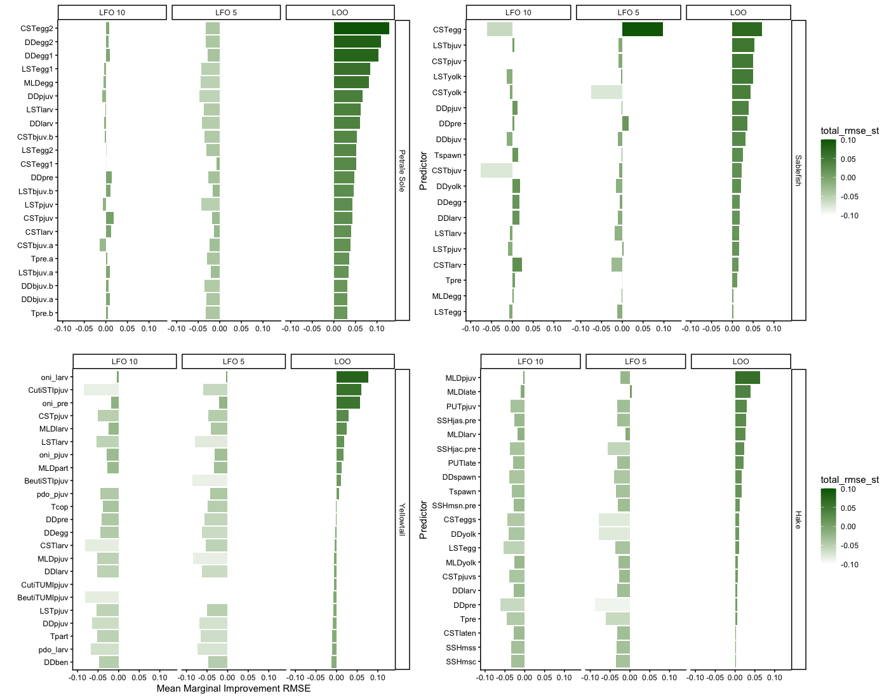
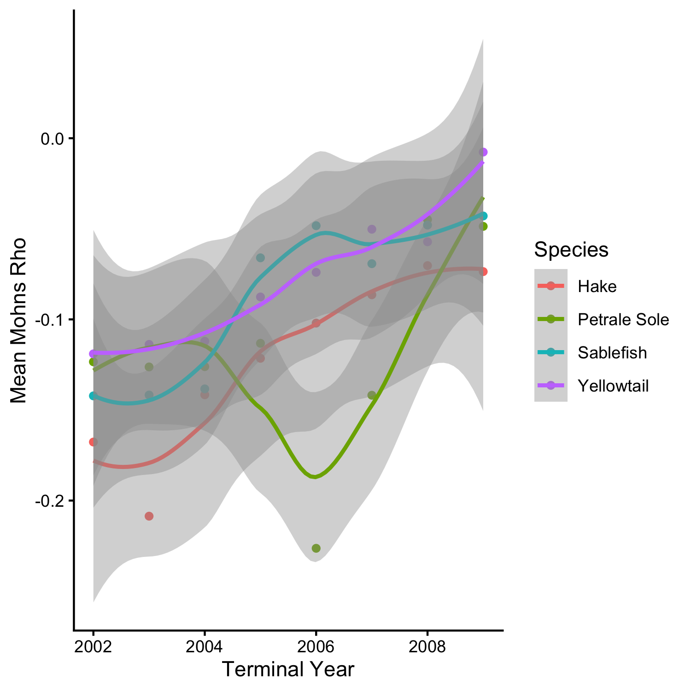
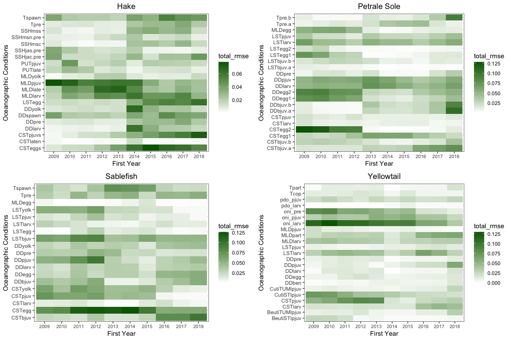

```{r}
#| include: FALSE

library(knitr)
library(dplyr)
library(kableExtra)
library(tidyverse)
```
## General themes

- Balancing index stability versus predictive capacity. Generally, both are important for indices in stock assessment application. Due to the ephemeral nature of many indices of recruitment, and the challenges of changing ocean dynamics (nonstationarity, extremes on threshold or dome shaped relationships), its important that indices used to inform management decisions are both robust and can support predictions. 

-

## If we only fit models from 1993 - 2010 do the inconsistencies in selection criteria change?

### Methods

We repeated the same methods from the March analysis but for all species the models were only fit from 1993 - 2010. Covariates were re-standardized over teh 1993 - 2010 period. We also omitted the rolling window analysis (as only two 15-year windows could be used with the reduced dataset).

### Findings

Overall, leave-future out criteria still performs poorly when applied to the 1993 - 2010 time period but this poor performance seems to be driven by short time series length rather than spanning seemingly distinct time periods. Additionally, the variables that are unstable from 1993 - 2018 tend to also be unstable over the 1993 - 2010 period. There seems to be two factors that jeopardize the utility of LFO in these circumstances. The first is whether or not there is an apparent regime shift in the oceanographic data and the second is time series length. Regardless of these two circumstances, variables that are unstable for a short time window without a regime shift seem to also be unstable in longer time series when a regime shift is included. Much like including the full time series, the best models, and the variables included in the best models, vary by selection criteria [@tbl-ps] - [@tbl-hk]

{#fig-rmse}

{#fig-fr}

{#fig-mohns}

{#fig-mohnstrend}

::: {.landscape}
```{r}
#| label: tbl-ps
#| tbl-cap: "Top 5 models for petrale sole using each of the three selection criteria. Leave-future-out could not differentiate between 100 competing models"
#| output: asis
#| echo: FALSE
#| message: FALSE
#| warning: FALSE

ps<-read.csv("Output/Data/ShortenedTS/ps_table.csv")
loops<-ps%>%
  select(variables, Hit, dev.ex, AIC, RMSE_loo,RMSE5, RMSE10)%>%
  arrange(RMSE_loo)%>%
  mutate(SelectionCriteria="LOO")%>%
  slice_head(n = 5)
lfo5ps<-ps%>%
  select(variables, Hit, dev.ex, AIC, RMSE_loo,RMSE5, RMSE10)%>%
  arrange(RMSE5)%>%
  mutate(SelectionCriteria="LFO5")%>%
  slice_head(n = 5)
lfo10ps<-ps%>%
  select(variables, Hit, dev.ex, AIC, RMSE_loo,RMSE5, RMSE10)%>%
  arrange(RMSE10)%>%
  mutate(SelectionCriteria="LFO10")%>%
  slice_head(n = 5)

ps_table<-loops%>%bind_rows(lfo5ps)%>%bind_rows(lfo10ps)
ps_table[, sapply(ps_table, is.numeric)] <- round(ps_table[, sapply(ps_table, is.numeric)], digits = 2)

kable(ps_table)%>%
  kable_styling(bootstrap_options = c("striped", "hover"), 
                full_width = FALSE)%>%
    kable_styling(bootstrap_options = c("striped", "hover")) %>%
  # Use pack_rows to create the subheadings based on the 'Group' column
  # Remove the 'Group' column from the main table display with remove_column
  pack_rows(
    index = table(fct_inorder(ps_table$SelectionCriteria)), # Automatically determine where groups start/end
  # remove_column = TRUE, # Hide the 'Group' column in the final table
    bold = TRUE, # Make subheadings bold
    background = "#f7f7f7" # Optional: add a light background color
  ) %>%
  column_spec(column = 1, width = "5cm") 


```


```{r}
#| label: tbl-sb
#| tbl-cap: "Top 5 models for sablefish using each of the three selection criteria"
#| output: asis
#| echo: FALSE
#| message: FALSE
#| warning: FALSE

sb<-read.csv("Output/Data/ShortenedTS/sb_table.csv")
loosb<-sb%>%
  select(variables,Hit,  dev.ex, AIC, RMSE_loo,RMSE5, RMSE10)%>%
  arrange(RMSE_loo)%>%
  mutate(SelectionCriteria="LOO")%>%
  slice_head(n = 5)
lfo5sb<-sb%>%
  select(variables,Hit,  dev.ex, AIC, RMSE_loo,RMSE5, RMSE10)%>%
  arrange(RMSE5)%>%
  mutate(SelectionCriteria="LFO5")%>%
  slice_head(n = 5)
lfo10sb<-sb%>%
  select(variables,Hit,  dev.ex, AIC, RMSE_loo,RMSE5, RMSE10)%>%
  arrange(RMSE10)%>%
  mutate(SelectionCriteria="LFO10")%>%
  slice_head(n = 5)

#nrow(sb%>%filter(RMSE10==min(na.omit(sb$RMSE10))))
#nrow(sb%>%filter(RMSE5==1.05))

sb_table<-loosb%>%bind_rows(lfo5sb)%>%bind_rows(lfo10sb)
sb_table[, sapply(sb_table, is.numeric)] <- round(sb_table[, sapply(sb_table, is.numeric)], digits = 2)

kable(sb_table)%>%
  kable_styling(bootstrap_options = c("striped", "hover"), 
                full_width = FALSE)%>%
    kable_styling(bootstrap_options = c("striped", "hover")) %>%
  # Use pack_rows to create the subheadings based on the 'Group' column
  # Remove the 'Group' column from the main table display with remove_column
  pack_rows(
    index = table(fct_inorder(sb_table$SelectionCriteria)), # Automatically determine where groups start/end
  # remove_column = TRUE, # Hide the 'Group' column in the final table
    bold = TRUE, # Make subheadings bold
    background = "#f7f7f7" # Optional: add a light background color
  ) %>%
  column_spec(column = 1, width = "5cm") 
```


```{r}
#| label: tbl-yt
#| tbl-cap: "Top 5 models for yellowtail using each of the three selection criteria"
#| output: asis
#| echo: FALSE
#| message: FALSE
#| warning: FALSE

yt<-read.csv("Output/Data/ShortenedTS/yt_table.csv")
looyt<-yt%>%
  select(variables,Hit,  dev.ex, AIC, RMSE_loo,RMSE5, RMSE10)%>%
  arrange(RMSE_loo)%>%
  mutate(SelectionCriteria="LOO")%>%
  slice_head(n = 5)
lfo5yt<-yt%>%
  select(variables,Hit,  dev.ex, AIC, RMSE_loo,RMSE5, RMSE10)%>%
  arrange(RMSE5)%>%
  mutate(SelectionCriteria="LFO5")%>%
  slice_head(n = 5)
lfo10yt<-yt%>%
  select(variables, Hit, dev.ex, AIC, RMSE_loo,RMSE5, RMSE10)%>%
  arrange(RMSE10)%>%
  mutate(SelectionCriteria="LFO10")%>%
  slice_head(n = 5)

yt_table<-looyt%>%bind_rows(lfo5yt)%>%bind_rows(lfo10yt)
yt_table[, sapply(yt_table, is.numeric)] <- round(yt_table[, sapply(yt_table, is.numeric)], digits = 2)

#nrow(yt%>%filter(RMSE10==min(na.omit(yt$RMSE10))))
#nrow(yt%>%filter(RMSE5==min(na.omit(yt$RMSE5))))

kable(yt_table)%>%
  kable_styling(bootstrap_options = c("striped", "hover"), 
                full_width = FALSE)%>%
    kable_styling(bootstrap_options = c("striped", "hover")) %>%
  # Use pack_rows to create the subheadings based on the 'Group' column
  # Remove the 'Group' column from the main table display with remove_column
  pack_rows(
    index = table(fct_inorder(yt_table$SelectionCriteria)), # Automatically determine where groups start/end
  # remove_column = TRUE, # Hide the 'Group' column in the final table
    bold = TRUE, # Make subheadings bold
    background = "#f7f7f7" # Optional: add a light background color
  ) %>%
  column_spec(column = 1, width = "5cm") 
```




```{r}
#| label: tbl-hk
#| tbl-cap: "Top 5 models for hake using each of the three selection criteria"
#| output: asis
#| echo: FALSE
#| message: FALSE
#| warning: FALSE

hk<-read.csv("Output/Data/ShortenedTS/hk_table.csv")
loohk<-hk%>%
  select(variables,Hit,  dev.ex, AIC, RMSE_loo,RMSE5, RMSE10)%>%
  arrange(RMSE_loo)%>%
  mutate(SelectionCriteria="LOO")%>%
  slice_head(n = 5)
lfo5hk<-hk%>%
  select(variables,Hit,  dev.ex, AIC, RMSE_loo,RMSE5, RMSE10)%>%
  arrange(RMSE5)%>%
  mutate(SelectionCriteria="LFO5")%>%
  slice_head(n = 5)
lfo10hk<-hk%>%
  select(variables, Hit, dev.ex, AIC, RMSE_loo,RMSE5, RMSE10)%>%
  arrange(RMSE10)%>%
  mutate(SelectionCriteria="LFO10")%>%
  slice_head(n = 5)

hk_table<-loohk%>%bind_rows(lfo5hk)%>%bind_rows(lfo10hk)
hk_table[, sapply(hk_table, is.numeric)] <- round(hk_table[, sapply(hk_table, is.numeric)], digits = 2)

nrow(hk%>%filter(RMSE10==min(na.omit(hk$RMSE10))))
nrow(hk%>%filter(RMSE5==min(na.omit(hk$RMSE5))))

kable(hk_table)%>%
  kable_styling(bootstrap_options = c("striped", "hover"), 
                full_width = FALSE)%>%
    kable_styling(bootstrap_options = c("striped", "hover")) %>%
  # Use pack_rows to create the subheadings based on the 'Group' column
  # Remove the 'Group' column from the main table display with remove_column
  pack_rows(
    index = table(fct_inorder(hk_table$SelectionCriteria)), # Automatically determine where groups start/end
  # remove_column = TRUE, # Hide the 'Group' column in the final table
    bold = TRUE, # Make subheadings bold
    background = "#f7f7f7" # Optional: add a light background color
  ) %>%
  column_spec(column = 1, width = "5cm") 
```
:::


## If we are more restrictive in the correlation we allow across oceanographic variables, are our results more consistent across ways of expressing predictive capacity?

### Methods

We repeated the same methods from the March analysis but for all species the models only used combinations of variables that had a pearson's correlation coefficient of 0.3 or less to reduce the number of covariates. 

### Findings

As expected, reducing the correlation coefficient has no impact on the highest ranked variables based on marginal mean improvement of RMSE and nor does it impact the ranking of stability. This is expected because of the nature of the ways these variables are calculated (either using models for only one variable based on stability or by reducing the impact of redundant variables in the case of marginal mean improvement RMSE).

But, we do see subtle differences in the rolling window analysis and the highest ranked models. Overall, this seems to be an ineffective way to minimize issues with predictive capacity indicating that overfitting or redundancy in oceanographic time series does not seem to be the primary issue. 

{#fig-rw}

::: {.landscape}
```{r}
#| label: tbl-ps2
#| tbl-cap: "Top 5 models for petrale sole using each of the three selection criteria. Leave-future-out could not differentiate between 100 competing models"
#| output: asis
#| echo: FALSE
#| message: FALSE
#| warning: FALSE

ps<-read.csv("Output/Data/CorrelationReduced/ps_table.csv")
loops<-ps%>%
  select(variables, Hit, dev.ex, AIC, RMSE_loo,RMSE5, RMSE10)%>%
  arrange(RMSE_loo)%>%
  mutate(SelectionCriteria="LOO")%>%
  slice_head(n = 5)
lfo5ps<-ps%>%
  select(variables, Hit, dev.ex, AIC, RMSE_loo,RMSE5, RMSE10)%>%
  arrange(RMSE5)%>%
  mutate(SelectionCriteria="LFO5")%>%
  slice_head(n = 5)
lfo10ps<-ps%>%
  select(variables, Hit, dev.ex, AIC, RMSE_loo,RMSE5, RMSE10)%>%
  arrange(RMSE10)%>%
  mutate(SelectionCriteria="LFO10")%>%
  slice_head(n = 5)

ps_table<-loops%>%bind_rows(lfo5ps)%>%bind_rows(lfo10ps)
ps_table[, sapply(ps_table, is.numeric)] <- round(ps_table[, sapply(ps_table, is.numeric)], digits = 2)

kable(ps_table)%>%
  kable_styling(bootstrap_options = c("striped", "hover"), 
                full_width = FALSE)%>%
    kable_styling(bootstrap_options = c("striped", "hover")) %>%
  # Use pack_rows to create the subheadings based on the 'Group' column
  # Remove the 'Group' column from the main table display with remove_column
  pack_rows(
    index = table(fct_inorder(ps_table$SelectionCriteria)), # Automatically determine where groups start/end
  # remove_column = TRUE, # Hide the 'Group' column in the final table
    bold = TRUE, # Make subheadings bold
    background = "#f7f7f7" # Optional: add a light background color
  ) %>%
  column_spec(column = 1, width = "5cm") 


```


```{r}
#| label: tbl-sb2
#| tbl-cap: "Top 5 models for sablefish using each of the three selection criteria"
#| output: asis
#| echo: FALSE
#| message: FALSE
#| warning: FALSE

sb<-read.csv("Output/Data/CorrelationReduced/sb_table.csv")
loosb<-sb%>%
  select(variables,Hit,  dev.ex, AIC, RMSE_loo,RMSE5, RMSE10)%>%
  arrange(RMSE_loo)%>%
  mutate(SelectionCriteria="LOO")%>%
  slice_head(n = 5)
lfo5sb<-sb%>%
  select(variables,Hit,  dev.ex, AIC, RMSE_loo,RMSE5, RMSE10)%>%
  arrange(RMSE5)%>%
  mutate(SelectionCriteria="LFO5")%>%
  slice_head(n = 5)
lfo10sb<-sb%>%
  select(variables,Hit,  dev.ex, AIC, RMSE_loo,RMSE5, RMSE10)%>%
  arrange(RMSE10)%>%
  mutate(SelectionCriteria="LFO10")%>%
  slice_head(n = 5)

#nrow(sb%>%filter(RMSE10==min(na.omit(sb$RMSE10))))
#nrow(sb%>%filter(RMSE5==1.05))

sb_table<-loosb%>%bind_rows(lfo5sb)%>%bind_rows(lfo10sb)
sb_table[, sapply(sb_table, is.numeric)] <- round(sb_table[, sapply(sb_table, is.numeric)], digits = 2)

kable(sb_table)%>%
  kable_styling(bootstrap_options = c("striped", "hover"), 
                full_width = FALSE)%>%
    kable_styling(bootstrap_options = c("striped", "hover")) %>%
  # Use pack_rows to create the subheadings based on the 'Group' column
  # Remove the 'Group' column from the main table display with remove_column
  pack_rows(
    index = table(fct_inorder(sb_table$SelectionCriteria)), # Automatically determine where groups start/end
  # remove_column = TRUE, # Hide the 'Group' column in the final table
    bold = TRUE, # Make subheadings bold
    background = "#f7f7f7" # Optional: add a light background color
  ) %>%
  column_spec(column = 1, width = "5cm") 
```


```{r}
#| label: tbl-yt2
#| tbl-cap: "Top 5 models for yellowtail using each of the three selection criteria"
#| output: asis
#| echo: FALSE
#| message: FALSE
#| warning: FALSE

yt<-read.csv("Output/Data/CorrelationReduced/yt_table.csv")
looyt<-yt%>%
  select(variables,Hit,  dev.ex, AIC, RMSE_loo,RMSE5, RMSE10)%>%
  arrange(RMSE_loo)%>%
  mutate(SelectionCriteria="LOO")%>%
  slice_head(n = 5)
lfo5yt<-yt%>%
  select(variables,Hit,  dev.ex, AIC, RMSE_loo,RMSE5, RMSE10)%>%
  arrange(RMSE5)%>%
  mutate(SelectionCriteria="LFO5")%>%
  slice_head(n = 5)
lfo10yt<-yt%>%
  select(variables, Hit, dev.ex, AIC, RMSE_loo,RMSE5, RMSE10)%>%
  arrange(RMSE10)%>%
  mutate(SelectionCriteria="LFO10")%>%
  slice_head(n = 5)

yt_table<-looyt%>%bind_rows(lfo5yt)%>%bind_rows(lfo10yt)
yt_table[, sapply(yt_table, is.numeric)] <- round(yt_table[, sapply(yt_table, is.numeric)], digits = 2)

#nrow(yt%>%filter(RMSE10==min(na.omit(yt$RMSE10))))
#nrow(yt%>%filter(RMSE5==min(na.omit(yt$RMSE5))))

kable(yt_table)%>%
  kable_styling(bootstrap_options = c("striped", "hover"), 
                full_width = FALSE)%>%
    kable_styling(bootstrap_options = c("striped", "hover")) %>%
  # Use pack_rows to create the subheadings based on the 'Group' column
  # Remove the 'Group' column from the main table display with remove_column
  pack_rows(
    index = table(fct_inorder(yt_table$SelectionCriteria)), # Automatically determine where groups start/end
  # remove_column = TRUE, # Hide the 'Group' column in the final table
    bold = TRUE, # Make subheadings bold
    background = "#f7f7f7" # Optional: add a light background color
  ) %>%
  column_spec(column = 1, width = "5cm") 
```




```{r}
#| label: tbl-hk2
#| tbl-cap: "Top 5 models for hake using each of the three selection criteria"
#| output: asis
#| echo: FALSE
#| message: FALSE
#| warning: FALSE

hk<-read.csv("Output/Data/CorrelationReduced/hk_table.csv")
loohk<-hk%>%
  select(variables,Hit,  dev.ex, AIC, RMSE_loo,RMSE5, RMSE10)%>%
  arrange(RMSE_loo)%>%
  mutate(SelectionCriteria="LOO")%>%
  slice_head(n = 5)
lfo5hk<-hk%>%
  select(variables,Hit,  dev.ex, AIC, RMSE_loo,RMSE5, RMSE10)%>%
  arrange(RMSE5)%>%
  mutate(SelectionCriteria="LFO5")%>%
  slice_head(n = 5)
lfo10hk<-hk%>%
  select(variables, Hit, dev.ex, AIC, RMSE_loo,RMSE5, RMSE10)%>%
  arrange(RMSE10)%>%
  mutate(SelectionCriteria="LFO10")%>%
  slice_head(n = 5)

hk_table<-loohk%>%bind_rows(lfo5hk)%>%bind_rows(lfo10hk)
hk_table[, sapply(hk_table, is.numeric)] <- round(hk_table[, sapply(hk_table, is.numeric)], digits = 2)

nrow(hk%>%filter(RMSE10==min(na.omit(hk$RMSE10))))
nrow(hk%>%filter(RMSE5==min(na.omit(hk$RMSE5))))

kable(hk_table)%>%
  kable_styling(bootstrap_options = c("striped", "hover"), 
                full_width = FALSE)%>%
    kable_styling(bootstrap_options = c("striped", "hover")) %>%
  # Use pack_rows to create the subheadings based on the 'Group' column
  # Remove the 'Group' column from the main table display with remove_column
  pack_rows(
    index = table(fct_inorder(hk_table$SelectionCriteria)), # Automatically determine where groups start/end
  # remove_column = TRUE, # Hide the 'Group' column in the final table
    bold = TRUE, # Make subheadings bold
    background = "#f7f7f7" # Optional: add a light background color
  ) %>%
  column_spec(column = 1, width = "5cm") 
```
:::


## If we remove "unstable" variables, is predictive capacity more consistent across variables?

### Methods
To do this analysis we fit the analysis approach we used in March (full time series 1994 - 2018; correlation coefficient of 0.5) and removed all variables that had a Mohn's rho of 0.15 (see @fig-mohns for reference). 
